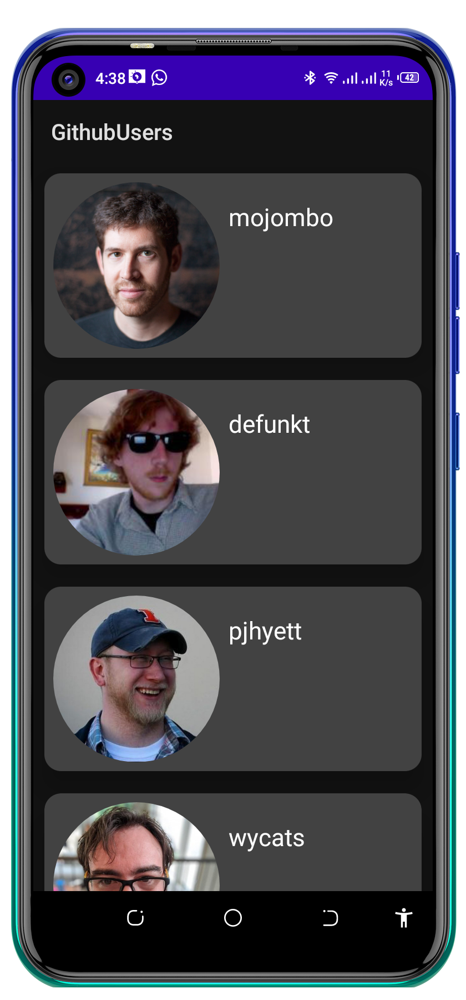
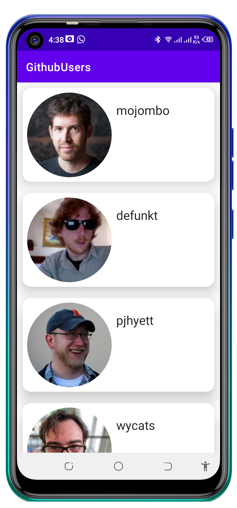

# GitHubUsers

A simple app that consumes The GitHub APIs to display github users. The aim was to learn about different jetpack libraries, built with MVVM pattern.

Min Api Level : 21

## Setup Requirements

- Android device or emulator
- Android Studio

## Getting Started

In order to get the app running yourself, you need to:

1.  clone this project
2.  Import the project into Android Studio
3.  Connect the android device with USB or just use your emulator
4.  In Android Studio, click on the "Run" button.

## Libraries

Libraries used in the whole application are:

- [Kotlin](https://developer.android.com/kotlin) - Kotlin is a programming language that can run on JVM. Google has announced Kotlin as one of its officially supported programming languages in Android Studio; and the Android community is migrating at a pace from Java to Kotlin
- [Viewmodel](https://developer.android.com/topic/libraries/architecture/viewmodel) -The ViewModel class is designed to store and manage UI-related data in a lifecycle conscious way
- [LiveData](https://developer.android.com/topic/libraries/architecture/livedata) -  A lifecycle-aware data holder with the observer pattern
- [Kotlin Coroutines](https://developer.android.com/kotlin/coroutines) - A concurrency design pattern that you can use on Android to simplify code that executes asynchronously
- [Retofit](https://square.github.io/retrofit) -  Retrofit is a REST Client for Java and Android by Square inc under Apache 2.0 license. Its a simple network library that used for network transactions. By using this library we can seamlessly capture JSON response from web service/web API.
- [Material Libarary](https://material.io/develop/android) -  Modular and customizable Material Design UI components for Android

## Demo

  

## Support
- Found this project useful ❤️? Support by clicking the ⭐️ button on the upper right of this page. ✌️
- Notice anything else missing? File an issue
- Feel free to contribute in any way to the project from typos in docs to code review are all welcome.